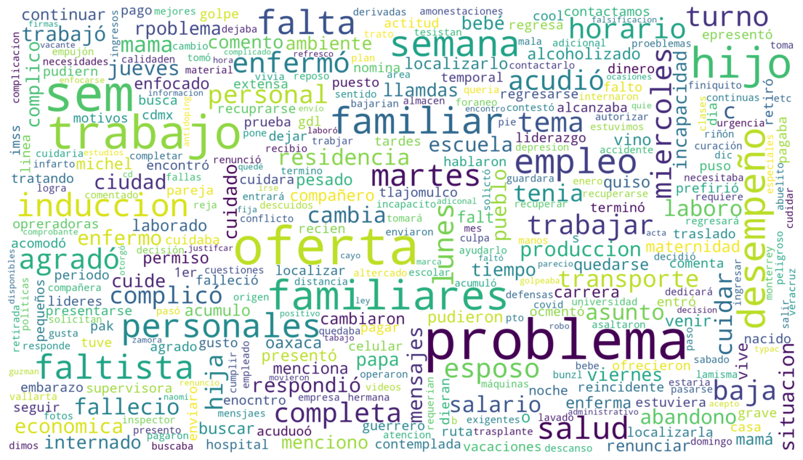

# Predicción de Rotación de Personal en Empresas Manufactureras de Tala, Jalisco 📊

En este repositorio se pretende desarrollar un modelo predictivo para la rotación de personal para empresas manufacturereras.

# Abstract 📝

En México la industria manufacturera presenta un alto porcentaje de rotación de personal, esto tiene un fuerte impacto económico en las empresas y por ende en la economía del país, buscando atender esta problemática e identificando el hecho de que no existe literatura acerca de la predicción de rotación de personal en la industria manufacturera de Jalisco, esta investigación tiene como objetivo el desarrollo y evaluación de algoritmos predictivos supervisados aplicados a la rotación de personal. 

# [Análisis exploratorio de datos (EDA) 🔍](results/EDA)

## Resultados 📝

Al iniciar el análisis exploratorio de datos, la base de datos tenía 16 variables, 502 entradas y 948 valores nulos, luego del proceso de limpieza de datos se concluyó con 14 variables, 495 registros y 0 valores núlos.

Se eliminaron las variables salario diario, ya que existe salario mensual y ambas aportan la misma información, y motivo de renuncia, que por su cantidad de valores faltantes y tratarse de texto abierto, su análisis va más allá del alcance de este estudio.

Finalmente, la visualización de datos permitió determinar que los empleados auxiliares de almacén son los que tienen una mayor rotación de personal y el personal que rola turno suele trabajar menos de 100 días antes de abandonar la empresa y que no existe una diferencia significativa entre el abandono de trabajo y el género.

# [Visualizaciones interactivas con Altair 📈](results/visuales_altair)

## Resultados 📝

# [Análisis de texto ✍️](results/analisis_sentimientos)

El análisis de texto se compone de 3 secciones; N-grams para detectar patrones, análisis de sentimientos para detectar carga positiva o negativa en los comentarios y una _word cloud_ para visualizar las palabras más comunes.

## Resultados 📝

En N-grams se detectó que los empleados en su mayoría abandonan su trabajo al encontrar una mejor oferta laboral, o por problemas familiares o son despedidas por su bajo desempeño laboral.

| Token 1      | Token 2       | Frecuencia | Bigram               |
|--------------|---------------|------------|----------------------|
| mejor        | oferta        | 32         | mejor oferta         |
| problemas    | familiares    | 19         | problemas familiares |
| bajo         | desempeño     | 13         | bajo desempeño       |
| temas        | personales    | 9          | temas personales     |
| problema     | familiar      | 7          | problema familiar    |

Del análisis de sentimientos se detectó que la mayoría de párrafos tenían una conotación negativa aunque se cuestiona el resultado pudiera ser discutido ya que los motivos son más bien postulados que no se prestan a un análisis más profundo.

| Paragraph                                                  | Polarity | Subjectivity |
|------------------------------------------------------------|----------|--------------|
| PROBLEMA PERSONAL                                          | 0.000    | 0.30         |
| CONFLICTO FAMILIAR CON UNA COMPAÑERA                       | 0.375    | 0.50         |
| PROBLEMA FAMILIAR                                          | 0.375    | 0.50         |
| COMENTA QUE DONDE TOMA EL TRANSPORTE DE COOL P...          | 0.350    | 0.65         |
| PARA TRABAJAR EN LA MISMA EMPRESA A LA QUE ENTR...         | 0.350    | 0.65         |
| PROBLEMA PERSONAL                                          | 0.000    | 0.30         |

Finalmente, abajo se deja el wordcloud para su visualizaicón:

# Estructura de repositorio 🗂️
    
    ├── data                                        <- Base de datos original.  
    |    |── README.md                              <- Descripción general del contenido del directorio.
    |    └── rotacion_personal.xlsx                 <- Base de datos.  
    |      
    ├── doc                                         <- Archivos de texto.
    |    └──  README.md                             <- Problema, objetivo y justificación del proyecto.
    |
    ├── results                                     <- Base de datos limpia y analizada.
    |    |── EDA
    |        └──  README.md  
    |    |── EDA_Analisis_sentimientos
    |        └──  README.md  
    |    |── visual_altair
    |        └──  README.md  
    |    └──  README.md                             <- Resultados escritos del análisis EDA.
    |  
    ├── src                                         <- archivos de código.    
    |    |── EDA.ipynb                              <- Archivo de código con análisis EDA.
    |    |── EDA_Analisis_sentimientos.ipynb
    |    |── analisis_rotacion_personal.ipynb
    |    |── analisis_sentimientos.ipynb
    |    |── visual_altair.ipynb                    <- Archivo de código con análisis EDA implementando graficos de Altair Gallery
    |    └── README.md                              <- Descripción general del contenido del directorio.
    |
    ├── CITATION.md                                 <- Cómo citar el proyecto.  
    |  
    ├── CONTRIBUTING.md                             <- Pasos para contribuir al proyecto.  
    |   
    ├── LICENSE                                     <- MIT License.  
    |  
    ├── README.md                                   <- Readme file principal con la descripción del proyecto.  
   
