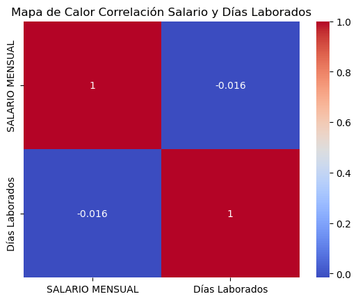

# Resultados de análisis EDA 🔍

El análisis EDA permitió detectar varios errores que se deben corregir en cada una de sus etapas. Comenzando con la descripción de los datos, se verificó que los índices eran correctos y que las variables parecían adecuadas. En total, se contaba con 16 variables y 502 registros, de los cuales no todos tenían el formato correcto. Por esta razón, las fechas fueron reformateadas siguiendo el formato recomendado por la ISO 8601: año, mes y día. Asimismo, las columnas de texto fueron convertidas al formato de cadena de caracteres (string) y se rellenaron los campos vacíos con valores NaN. Aunque este proceso sería más adecuado en la etapa de limpieza de datos, en este caso fue necesario realizarlo en este punto para obtener una visión general de la base de datos.

En total, se identificaron 6 variables cuantitativas y 10 categóricas.

Al revisar las variables con fechas (fecha de ingreso, fecha de baja y fecha de nacimiento), se detectó que algunas fechas de nacimiento correspondían al año 2022, lo cual era incorrecto, ya que la edad mínima para trabajar es de 18 años. Por esta razón, se sustituyeron las fechas de nacimiento de aquellas personas que no cumplían con los 18 años por el mínimo legal de 18 años. Además, los valores nulos en las fechas fueron reemplazados por la media.

La variable objetivo contiene dos valores: "baja" y "activo", y no tiene valores nulos. Sin embargo, los días laborados sí presentaban valores nulos, lo cual era coherente, ya que esta variable resultaba de restar la fecha de ingreso de la fecha de salida. Por lo tanto, los empleados activos, al no tener una fecha de salida, no tenían un número de días laborados. Se decidió entonces actualizar la fecha de salida con la fecha del último registro, y en los valores nulos se colocó la fecha de corte de los datos (30 de abril de 2024), para luego restar la fecha de ingreso, eliminando así los valores nulos en las variables de fecha de salida y días laborados.

En la variable "Crédito Infonavit" se detectaron valores inconsistentes como 'Si', 'NO', 'NO ' y 'SI', los cuales se unificaron en dos categorías. Además, se identificaron 6 puestos distintos, de los cuales uno correspondía a intendencia. Como este análisis se enfoca en empleados de producción, se excluyeron los registros de intendencia.

| PUESTO            | Días Laborados |
|-------------------|----------------|
| AUXILIAR ALMACEN  | 220            |
| INSP CALIDAD      | 134            |
| MECANICO          | 128            |
| MONTACARGUISTA    | 165            |
| OP PRENSA         | 43             |
| OP PRODUCCION     | 151            |

En la variable "municipio", se identificó la presencia de "Jalisco", que no es un municipio. Sin embargo, se asumió que se trataba de Zapopan.

| Municipio               | Frecuencia |
|-------------------------|------------|
| TALA                    | 458        |
| ZAPOPAN                 | 12         |
| EL ARENAL               | 10         |
| TLAJOMULCO              | 3          |
| HUAXTLA                 | 3          |
| LA VENTA DEL ASTILLERO  | 2          |
| ZAMORA                  | 2          |
| CD GUZMAN               | 2          |
| AHUISCULCO              | 1          |
| BUENA VISTA             | 1          |
| SAN JUAN DE LOS ARCOS   | 1          |

Los salarios, tanto diarios como mensuales, también presentaban valores nulos, y algunos estaban por debajo del salario mínimo vigente en el momento de la contratación. Estos valores fueron rellenados con la media.

Estos cambios son algunos de los más relevantes en el proceso de limpieza de datos y resultaron en visualizaciones que aportan gran valor al análisis posterior.

En primer lugar, se observó que la mayor cantidad de ingresos ocurrió en enero de 2022, coincidiendo con el regreso a la "nueva normalidad" tras la pandemia de COVID-19.

La mayoría de los registros corresponden a empleados que ya han abandonado la empresa, con un total de 425 registros, mientras que 70 empleados siguen activos.

Los empleados trabajan en promedio 229 días en la empresa, aunque la mayoría trabaja menos de 100 días. Además, en promedio, los empleados nacieron en 1991 y la mayoría son menores de 35 años y operadores de producción.

| TURNO | Días Laborados |
|-------|----------------|
| A     | 131            |
| B     | 121            |
| C     | 111            |
| ROLA  | 101            |

La información más relevante de este análisis exploratorio es que los empleados con más tiempo en sus puestos son los auxiliares de almacén, mientras que los operadores de producción tienen el menor tiempo en la empresa. No se observó una diferencia significativa entre los distintos turnos, aunque los empleados que rotan turnos presentaron una mayor rotación. En cuanto a la formación académica, los empleados con menor rotación son aquellos que están cursando la secundaria o han concluido la preparatoria, mientras que los de mayor rotación son aquellos con secundaria incompleta o que están cursando la preparatoria.

Finalmente, se realizó un mapa de calor para analizar si existía alguna correlación entre el sueldo y los días laborados, obteniendo un valor de -0.016. Esto indica que no se puede confirmar una correlación significativa entre estas variables numéricas.

En conclusión, este análisis inicial sienta las bases para estudios posteriores que buscarán predecir la rotación de personal, tomando como referencia las variables discutidas en este apartado.
