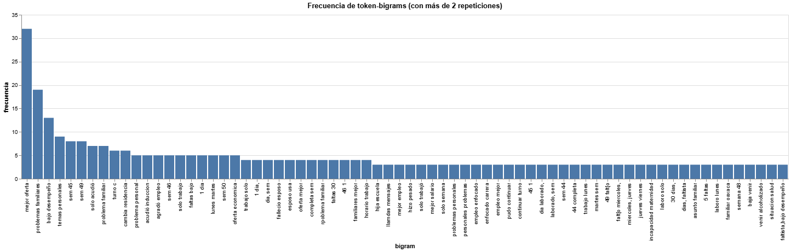
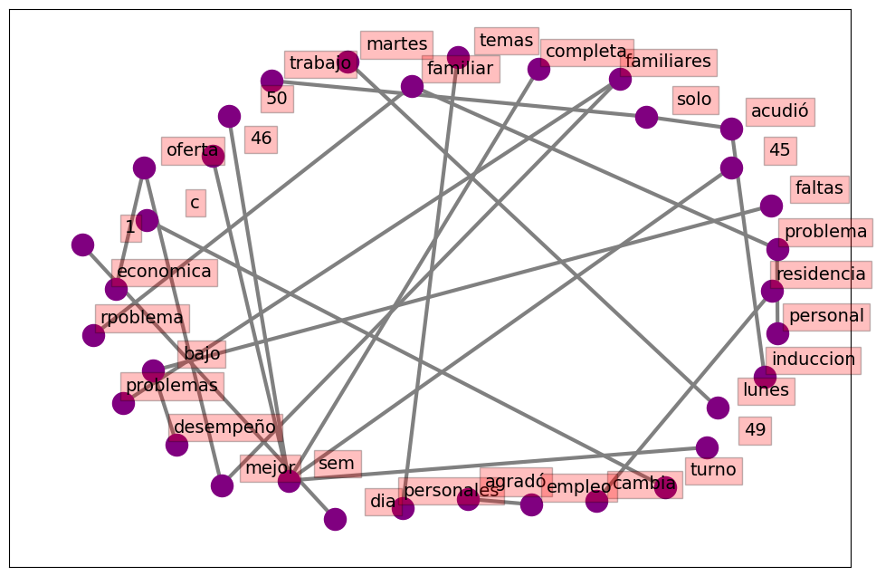
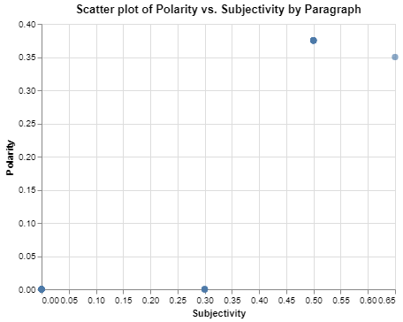

# Resultados de análisis de texto 🔍

El análisis de texto se dividió en tres secciones; se realizó N-grams para detectar patrones de palabras u oraciones, se realizó un análisis de sentimientos para detectar si existía alguna carga positiva o negativa en los comentarios y finalmente una _word cloud_ para visualizar las palabras más comunes.

## Resultados N-grams ✍️

En este análisis se detectó que las palabras que más se repetía con 32 fue __mejor oferta__, es decir, en su mayoría los empleados que abandonaron la empresa lo hicieron al encontrar una mejor oferta laboral, lo cuál encaja con el hecho de que la industria manufacturera es una de las más competidas en términos de salario y prestaciones.

Llama la atención que la segunda palabra con una mayor repetición fue __problemas familiares__ con 19 y que podría encajar también en la cuarta categoría con 9 repeticiones __problemas personales__, y que pudiera parecer una justificación no del todo explicativa pero luego de comentarse estos resultados con el departamento de recursos humanos, en repetidas ocasiones estos problemas pueden tratarse de tener qué tomar un rol mucho más participativo en los cuidados de la familia (familiar enfermo, hijos menores, entre otros).

En el diagrama de correlación de palabras se detectó relaciones interesantes como __problemas familiares, problemas en la inducción, problemas con la residencia y con el desempeño__, esto nos da una idea de que en su mayoría es la percepción de problemas en distintos aspectos lo que genera rotación de personal en la industria manufacturarera, ahora bien, estas relaciones muestran los problemas que hay que atender para aminorar la rotación.

## Análisis de sentimientos 💬

Del análisis de sentimientos no se lograron obtener resultados concluyentes ya que en su mayoría los motivos de renuncia son oraciones puntuales que no dan mucho contenido de análisis, no obstante se destaca que en su totalidad los resultados arrojan valores por debajo de .40, es decir, todos los comentarios tienen una carga mayoritariamente negativa.

## Word cloud ☁️

De este análisis podemos concluir que en su mayoría, los empleados abandonan su empleo por problemas en distintos índoles, se sugiere en análisis posteriores, profundizar en estas problemáticas y proponer soluciones a las mismas.